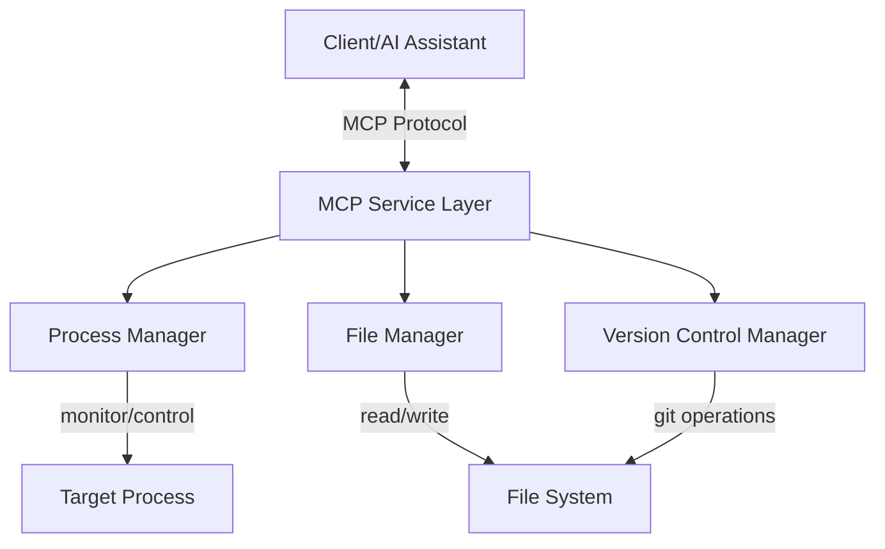

# System Patterns: Python Supervisor Process

## System Architecture

The Python Supervisor Process follows a modular architecture organized around core responsibilities of process management, file operations, and MCP service integration.

## Key Components

### MCP Service Layer

This layer acts as the interface between clients (including AI assistants) and the supervisor's core functionality. It exposes standardized MCP services for process management, file operations, and version control.

**Responsibilities:**
- Implement MCP protocol for service exposure
- Handle incoming requests and route to appropriate components
- Format responses according to MCP specifications
- Manage authentication and authorization
- Provide logging and error handling

### Process Manager

The Process Manager handles all aspects of target process lifecycle management.

**Responsibilities:**
- Monitor target process health and status
- Start processes when requested
- Restart processes safely with minimal downtime
- Capture and route process output
- Handle process errors and crashes

### File Manager

The File Manager handles all file system operations, including reading, editing, and searching files.

**Responsibilities:**
- Read file contents
- Write updates to files
- Apply diffs to files
- Search across files using ripgrep
- Handle file system errors

### Version Control Manager

The Version Control Manager provides Git integration for code management.

**Responsibilities:**
- Execute Git commands like restore and commit
- Handle Git conflicts and errors
- Track file changes
- Provide version history

## Design Patterns

### Observer Pattern

Used for monitoring the target process status. The supervisor observes the process and reacts to state changes.

### Command Pattern

Used for encapsulating operations like file edits, git commands, and process controls as discrete, executable commands.

### Facade Pattern

The MCP Service Layer acts as a facade, providing a simplified interface to the complex subsystems.

### Strategy Pattern

Used for different implementation strategies of file operations, process management, and version control.

## Data Flow

1. **Client Requests**: Clients send requests through the MCP protocol to the supervisor
2. **Request Processing**: The MCP Service Layer validates and routes requests
3. **Component Execution**: The appropriate component (Process Manager, File Manager, or Version Control Manager) executes the requested operation
4. **Response Generation**: The operation result is packaged as an MCP response
5. **Client Notification**: The client receives the response

## Key Technical Decisions

1. **Process Monitoring Approach**: Using a non-invasive monitoring approach that minimizes overhead on the target process

2. **File Modification Safety**: Implementing safety checks and backup mechanisms for file modifications to prevent corruption

3. **MCP Service Design**: Designing granular, focused services that map clearly to specific operations

4. **Error Handling Strategy**: Comprehensive error handling at both the service level and component level

5. **State Management**: Maintaining minimal state to improve reliability and simplify recovery

## Component Relationships

### Process Manager → Target Process

The Process Manager maintains a parent-child relationship with the target process, allowing for monitoring and control.

### File Manager → File System

The File Manager acts as an abstraction layer over the file system, providing controlled access to files.

### Version Control Manager → File System

The Version Control Manager interacts with the Git repository in the file system, tracking and committing changes.

### MCP Service Layer → Components

The MCP Service Layer delegates operations to the appropriate components, acting as a coordination layer.

## Security Considerations

1. **Access Control**: Limiting operations based on client authorization
2. **Input Validation**: Thorough validation of all inputs to prevent injection attacks
3. **Process Isolation**: Ensuring proper isolation between the supervisor and target processes
4. **File Operation Boundaries**: Restricting file operations to designated directories
5. **Audit Logging**: Logging all operations for security auditing
